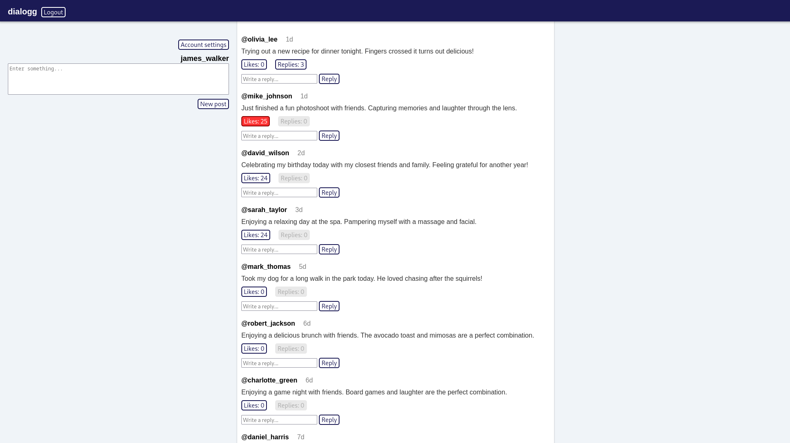
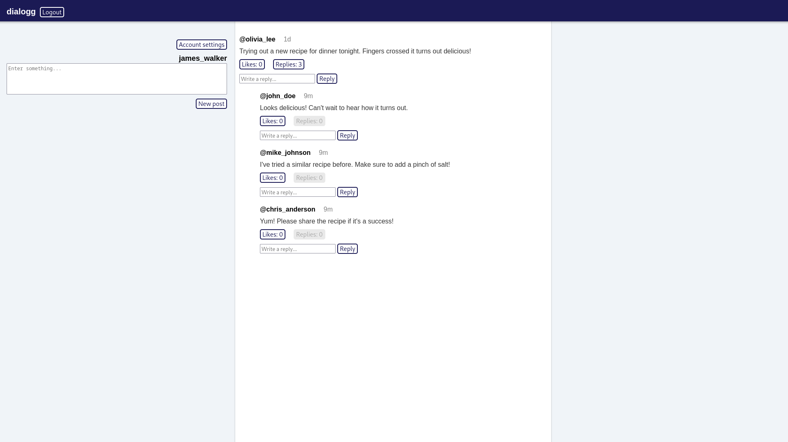
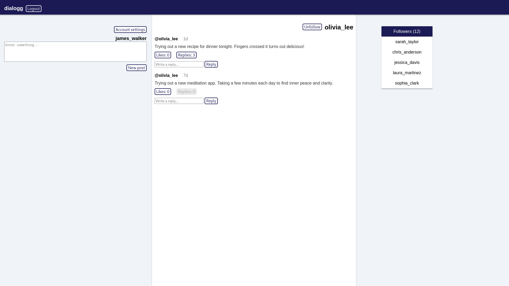

# Dialogg - Social Media Web Application

Dialogg is a web application built using Java and the Spring Boot framework. It provides a platform for users to interact by sharing content, allowing them to connect with others in a social setting.

## Features

- User registration and authentication
- Post content and reply to posts
- Follow other users
- Like content
- Manage user settings

## Technologies Used

- Java
- Spring Boot
- Thymeleaf

## Screenshots

